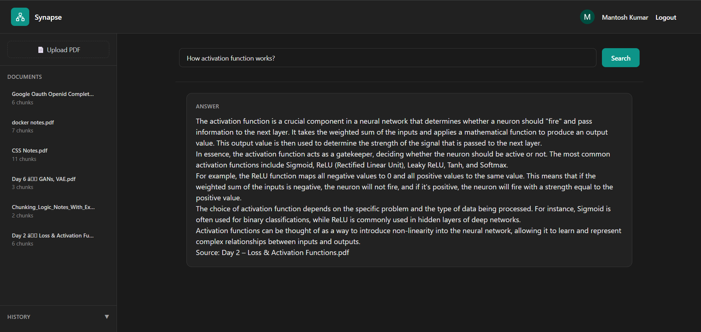

# Synapse — Personal Knowledge Engine

A RAG (Retrieval-Augmented Generation) system that lets you upload PDF documents and ask questions in plain English. Every answer includes the source so you can verify it.

**Live Demo:** [https://synapse-project-pi.vercel.app](https://synapse-project-pi.vercel.app)

---

## What it does

- Upload your PDF documents
- Ask questions in plain English
- Get AI-generated answers with exact source references
- Search history saved for later reference

---

## Tech Stack

**Frontend**
- React + Vite
- TailwindCSS

**Backend**
- Node.js + Express
- Prisma ORM

**Database**
- PostgreSQL + pgvector (vector similarity search)

**AI / ML**
- Cohere — text embeddings
- Groq — LLM inference (llama-3.1-8b-instant)

**Auth**
- JWT + HTTP-only cookies
- Google OAuth 2.0

**Deployment**
- Frontend — Vercel
- Backend — Render
- Database — Neon (serverless PostgreSQL)

---

## How it works

1. **Upload** — PDF text is extracted and split into sentence-aware chunks
2. **Embed** — Each chunk is converted to a vector using Cohere embeddings
3. **Store** — Vectors are stored in PostgreSQL using pgvector extension
4. **Search** — User query is embedded and compared against stored vectors using cosine similarity
5. **Answer** — Top matching chunks are passed to Groq LLM which generates a grounded answer with source attribution

No LangChain used — the entire RAG pipeline is implemented from scratch.

---

## Screenshots



---

## Local Setup

### Prerequisites
- Node.js
- Neon DB account (free — neon.tech)
- Cohere API key (free — dashboard.cohere.com)
- Groq API key (free — console.groq.com)
- Google OAuth credentials

### Clone the repo

```bash
git clone https://github.com/mantosh7/Synapse-Project
cd Synapse-Project
```

### Backend setup

```bash
cd server
npm install
```

Create `.env` file in `server/` folder:

```env
DATABASE_URL=your_postgresql_url
JWT_SECRET=your_secret
GOOGLE_CLIENT_ID=your_google_client_id
GOOGLE_CLIENT_SECRET=your_google_client_secret
GOOGLE_REDIRECT_URI=http://localhost:5173/auth/callback
CLIENT_URL=http://localhost:5173
GROQ_API_KEY=your_groq_key
COHERE_API_KEY=your_cohere_key
PORT=5000
NODE_ENV=development
```

Run migrations:

```bash
npx prisma migrate deploy
```

Start server:

```bash
npm run dev
```

### Frontend setup

```bash
cd client
npm install
```

Create `.env` file in `client/` folder:

```env
VITE_API_URL=http://localhost:5000
VITE_GOOGLE_CLIENT_ID=your_google_client_id
VITE_GOOGLE_REDIRECT_URI=http://localhost:5173/auth/callback
```

Start frontend:

```bash
npm run dev
```

---

## Project Structure

```
Synapse-Project/
├── client/                  # React frontend
│   ├── src/
│   │   ├── components/      # ProtectedRoute, GuestRoute
│   │   ├── pages/           # Landing, Login, Register, Dashboard
│   │   └── services/        # Axios instance
│   └── vercel.json
│
└── server/                  # Express backend
    ├── src/
    │   ├── controllers/     # Request handlers
    │   ├── routes/          # API routes
    │   ├── services/        # Business logic — RAG pipeline
    │   ├── middlewares/     # Auth, error handler
    │   └── config/          # Database connection
    └── prisma/              # Schema and migrations
```

---

## API Routes

```
POST /api/auth/register         — Register with email/password
POST /api/auth/login            — Login with email/password
POST /api/auth/logout           — Logout
GET  /api/auth/me               — Get current user
POST /api/auth/google/callback  — Google OAuth callback

POST /api/documents             — Upload PDF
GET  /api/documents             — Get all documents
DELETE /api/documents/:id       — Delete document

POST /api/search                — Search and get answer
GET  /api/search/history        — Get search history
DELETE /api/search/history/:id  — Delete history item
```

---

## Known Limitations

- Free tier on Render — first request may be slow due to cold start
- Cohere trial key — rate limited
- Works best with text-based PDFs — scanned documents may not extract well

---

*Built as a learning project to understand RAG systems, vector search, and LLM integration.*